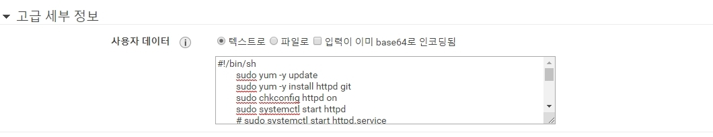

# AWS TEST Home Page Create

 
> 1. AMI 선택  => __Amazon Linux 2 AMI (HVM), SSD Volume Type__ AMI 선택
> 2. 인스턴스 유형 선택 => __t2.micro__
> 3. 인스턴스 구성 => 고급 세부 정보 : __사용자 데이터 항목란에 아래 Script 입력__
> 4. 스토리지 추가 : 기본  
> 5. 태그 추가: 기본
> 6. 보안 그룹 구성: 기본
> 7. 검토: 기본

 
<pre><code class='LANG'>
#### 고급 세부 정보 : 사용자 데이터 항목란

 </img> 

	#!/bin/sh 
	sudo yum -y update
	sudo yum -y install httpd git
	sudo chkconfig httpd on
	sudo systemctl start httpd
	# sudo systemctl start httpd.service
	if [ ! -f /var/www/html/index.html ]; then
	cd /var/www/html
	git clone https://github.com/zkalsk/homepage.git
	cd homepage
	mv * ../
	cd ..
	rm -fR homepage
	chown -R apache:root /var/www/html
	fi
  </code>
</pre>

